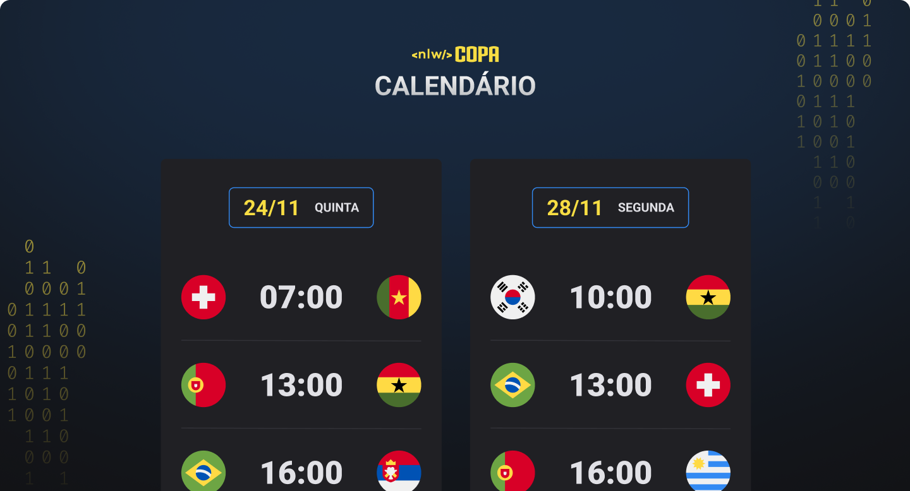

<h1 align="center"> NLW #10 Copa </h1>

Exclusive and free event, promoted by Rocketseat for teaching WEB technologies.

  <a href="#-technologies">Technologies</a>&nbsp;&nbsp;&nbsp;|&nbsp;&nbsp;&nbsp;
  <a href="#-project">Project</a>&nbsp;&nbsp;&nbsp;|&nbsp;&nbsp;&nbsp;
  <a href="#-layout">Layout</a>&nbsp;&nbsp;&nbsp;|&nbsp;&nbsp;&nbsp;
  <a href="#memo-license">License</a>

  

 

  

## 🚀 Technologies

This project was developed with the following technologies:

- HTML e CSS
- JavaScript
- Git e Github

## 💻 Project

The World Cup Calendar is a project that shows the games of the 2022 World Cup.

## 🔖 Layout

You can view the layout of the project through [THIS LINK](https://www.figma.com/file/J1Z33MISC22YZB8wfxiIns/NLW-Copa-Explorer/duplicate). It is necessary to take account on [Figma](https://figma.com) to access it.

## :memo: License

This project is licensed under MIT.

---

Made with ♥ by Rocketseat :wave: [Be part of our community!](https://discord.gg/rocketseat)